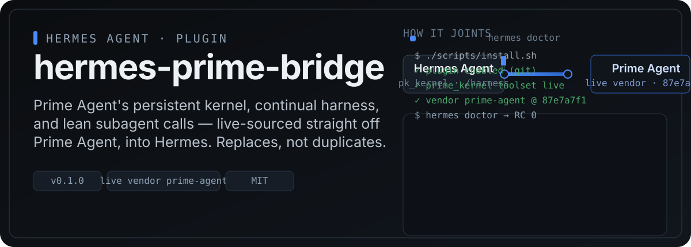
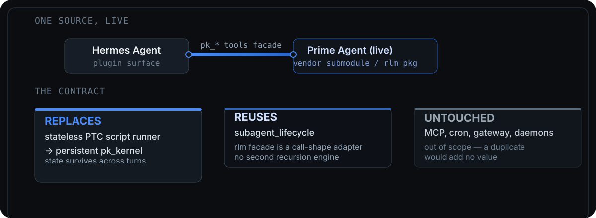

<!-- T2I HERO SPEC — Subject: a bridge — two agent runtimes (Hermes left, Prime right) with a single load-bearing span between them carrying a persistent kernel and a versioned harness; upstream Prime source flows along the span into Hermes, with a fork symbol crossed out. Composition: left-right bridge, glowing traffic, badge reads "replaces, not duplicates". Palette: deep slate #0f172a → violet #8b5cf6 (Hermes) → cyan #22d3ee (Prime), gold #f59e0b for the live flow. Style: flat vector bridge architecture, dark, no text besides motif. 16:9. -->

<p align="center">
  
</p>

<p align="center">
  <a href="https://github.com/ishan-parihar/hermes-prime-bridge/actions"></a>
[](https://github.com/ishan-parihar/hermes-prime-bridge/actions/workflows/ci.yml)
  <a href="LICENSE"></a>
  
</p>

**hermes-prime-bridge** is a [Hermes Agent](https://github.com/primeintellect-ai/hermes-agent) plugin that ports the strengths of [Prime Agent](https://github.com/PrimeIntellect-ai/prime-agent) — a **stateful kernel** and a **continual-refinement harness** — directly from **live upstream Prime source**. Rather than forking or copy-pasting, the plugin pulls Prime Agent as a pinned submodule at `vendor/prime-agent` and imports its real `rlm` runtime (the harness-state library), so upgrades propagate on their own.

The guiding directive is **replace, never duplicate**: every capability the bridge brings either *replaces* a redundant Hermes path or is an *adapter* over a Hermes-owned backend. It never plants a second, competing engine side-by-side with the thing it touches.

> **v0.2 scope change.** Earlier versions also exposed `rlm` / `rlm_list` / `rlm_get` / `rlm_delete` subagent ergonomics. These have been removed — they were thin call-shape adapters over Hermes' `subagent_lifecycle` and duplicated the existing `delegate_task` tool without adding capability. For subagent work, use `delegate_task`. The bridge now ships only the one capability Hermes lacks natively: a **persistent stateful Python kernel** plus its **continual-harness refinement store**.

---

## Why it exists

Hermes is a narrow-waisted, stateless agent: each Python call is a fresh subprocess, tool schemas stay lean, and the "prompt-contract" (PTC) pipeline rebuilds context per message. Prime Agent grew one strength Hermes lacks: a **persistent kernel** where variables, imports, and intermediate values survive across turns.

This plugin imports that single strength as *one* integration surface — a **live** one, so nothing ships as a frozen copy.

---

## What it brings

| Prime feature | Hermes today | The bridge replaces it with |
|---|---|---|
| **Persistent stateful kernel** | `execute_code` (stateless script-per-call) | `pk_kernel_exec` — kernel state persists across turns |
| **Continual harness** (`memory/prompt/skill/subagent`) | curator + memory_manager | `pk_harness_get` + `pk_refine` + `/harness` — versioned, scoped, refinement-ready |
| **Python-executable skills** | markdown-first SKILL.md | `pyskill` loader (roadmap) |

Full tour of the code: [`docs/REPLACES.md`](docs/REPLACES.md) records the exact replace-vs-reuse-vs-untouched decision for every surface.

## How it compares

| Approach | What it ships | Maintenance | Verdict |
|---|---|---|---|
| **hermes-prime-bridge** (this) | Live import of Prime's `rlm` kernel via pinned submodule — one integration surface | Upgrades propagate automatically | ✅ **Replace, never duplicate** |
| Fork Prime Agent | A second, competing agent beside Hermes | Two codebases to update forever | ❌ duplicates |
| Copy-paste the kernel | Frozen code that rots | Manual sync of every Prime change | ❌ duplicates |
| Re-implement in Hermes | Third implementation of statefulness | Most expensive to maintain | ❌ duplicates |
| Keep Hermes stateless | No persistence — the original gap | None, but gap remains | ⚠️ gap |

Every capability the bridge adds *replaces* a redundant Hermes path or *adapts* a Hermes-owned backend — the directive, enforced in code review, is **never plant a second engine** beside the thing it touches.

---

## The replaces-not-duplicates contract

<p align="center">
  
</p>

The rule, per layer:

- **One kernel authority.** The stateful kernel is *the* Python execution path for interactive/stateful work; the stateless script path stays available for batch/RPC tool-calling.
- **Separate memory lanes.** The harness store reads/writes its own scoped JSON; it never mutates Hermes' memory-provider records (`agentmemory`, `memory` tool, curator).
- **No duplicate subagent engine.** v0.2 removed the `rlm_*` ergonomics. Use `delegate_task` for subagent work.
- **Live upstream.** Every Python import of the Prime runtime resolves through `vendor/prime-agent/.../rlm` — a real pinned checkout, not a snapshot — so `git submodule update --remote` pulls new Prime behavior into the bridge.

---

## Quick start (native Hermes, any host)

**One command** — install from any machine that has `curl` and `git`:

```bash
bash <(curl -fsSL https://raw.githubusercontent.com/ishan-parihar/hermes-prime-bridge/main/scripts/install.sh) \
  https://github.com/ishan-parihar/hermes-prime-bridge.git
```

The installer finds Hermes home, clones the bridge — **with its live submodule** — into `~/.hermes/plugins/hermes-prime-bridge/`, enables it, and confirms with `hermes doctor`. No repo checkout required on the target host.

Prefer the source over the script? Clone with the submodule and run the installer from it:

```bash
git clone --recurse-submodules https://github.com/ishan-parihar/hermes-prime-bridge.git
cd hermes-prime-bridge
./scripts/install.sh
```

Verify it is live:

```bash
hermes plugins list | grep hermes-prime-bridge   # enabled, source: git
hermes tools list                               # prime_kernel toolset (Prime Kernel)
hermes doctor                                   # prime_kernel under Tool Availability
```

From inside an Hermes session the toolset is available to the model:

- `pk_kernel_exec(code, namespace?)` — run Python in the persistent kernel; state persists across turns.
- `pk_harness_get(kind, id?)` — read back continual-harness entries (memory, prompts, skills, subagents).
- `pk_refine(evidence, trigger?)` — record a small, evidence-backed harness refinement.
- Slash commands: `/harness [list]`, `/kernel [reset|size]`.

---

## Roadmap

- [x] **Bridge + installer** — native install via `scripts/install.sh`, live-submodule vendor.
- [x] **Persistent kernel + harness tools** — state and continual records end-to-end.
- [x] **Replacements documented** — `docs/REPLACES.md` contract.
- [x] **v0.2: rlm ergonomics removed** — duplicate of `delegate_task` deleted; plugin scope narrowed to the stateful kernel + harness.
- [ ] **`pyskill` executor** — run Python-backed skills through the existing Hermes skill surface.
- [ ] **Live-update workflow** — verify `hermes plugins update hermes-prime-bridge` pulls new Prime submodule pin.

---

## Development

This repo is a Python package plus an Hermes directory-plugin wrapper. Tests run in the repo-local venv:

```bash
uv sync
uv run pytest -q      # 14 tests
```

The root `__init__.py` satisfies both **Hermes' directory-plugin loader** (relative import) and **pytest** (module import) through a single dual-path entry — see `pyproject.toml` for the `--import-mode=importlib` note.

### Layout

```
pyproject.toml        # pip-installable; hermes_agent.plugins entry group
plugin.yaml           # Hermes directory-plugin manifest (provides_tools / provides_hooks)
bridge/
  __init__.py         # register(ctx) re-export
  plugin.py           # register(ctx): tools, hooks, slash commands
  vendor.py           # import Prime rlm live from vendor submodule (harness-state library)
  kernel.py            # persistent per-session kernel
  harness.py           # continual-harness store adapter
  schemas.py          # LLM tool schemas
  pyskill.py           # Python-executable skill support (roadmap)
tests/                # pytest suite (14 contract + integration)
vendor/prime-agent    # submodule (pinned)
scripts/install.sh    # native installer (clone --recurse-submodules)
scripts/update.sh     # advance the vendored pin
docs/REPLACES.md      # replaces / complements / untouched contract
```

---

## License

MIT
